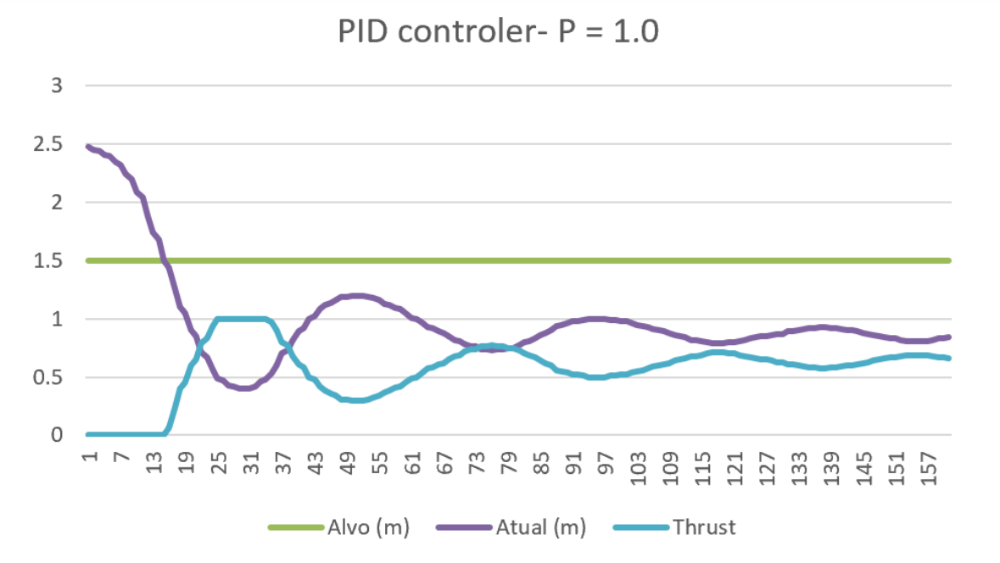

# BlueRovProject

--------------------------------------------------------------------------------

Done when studing in Escola Náutica Infante Dom Henrique.

 

I was project manager with 7 teams of a total 12 members.

## PID results:

Podemos analisar no primeiro gráfico que o ROV chega a um nível de $thrust < 0,5$ e desce de profundidade. Convém relembrar que o sinal de controlo dos propulsores do ROV é, $u(t) = 0 = Full Reverse$, $u(t) = 0,5 = Neutro$, $u(t) = 1 = Full propulsores$. 
Para normalizar este valor é preciso que quando o controlador PID quiser colocar os motores no neutro ou abrandar que esse valor não fica inferior a $0,5$. Para fazer isso é preciso que,

$$e = 0 \rightarrow u(t) = 0 \rightarrow u'(t) = 0,5$$
$$e > 0 \rightarrow u(t) > 0 \rightarrow u'(t) > 0,5$$
$$e < 0 \rightarrow u(t) < 0 \rightarrow u'(t) < 0,5$$

Sendo $u(t)$ a saída que o PID iria ter (já normalizada) e $u'(t)$ é a saída que precisa de ter para evitar o problema referido e analisado.

### Skills melhoradas / aprendidas:
      - Gestão de Equipa
      - Desenvolvimento de software (Python)
      - Navegação baseada em terreno (TBN)
      - Navegação por Inércia (INS)
      - Controlador PID
      - MAVLink
      - Telemetria 
      - Manutenção do ROV
### Projetos desenvolvidos
      - Analise de telemetria sensorial
      - Manter a profundidade (PID controler)
      - INS autónomo 

# Descrição do projeto/tecnologias
      - Ping360 Scanning Imaging Sonar
      - Newton Subsea Gripper (Garra)
      - Sensores IMUs
      - Sensor de pressão
      - Câmera

