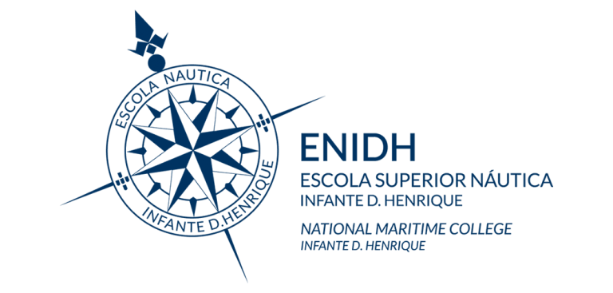

# BlueRovProject

--------------------------------------------------------------------------------

This repository shows my projects done with the BlueRov2 submarine.

Done when studing in Escola Náutica Infante Dom Henrique.

 
- [[Navegação Acústica]]
- [[ROV Vision]]
- [[Projetos]]

![[OceanEngineering_SurveyonAdvancesonTerrainBasedNavigationForAutonomousUnderwaterVehicles.pdf]]
![[rCritica_ROVarticleOcean.pdf]]
### Skills melhoradas / aprendidas:
      - Team management
      - Software Development 
      - Python
      - Terrain-Based-Navegation
      - Inertial Navegation
      - PID controler 
      - MavLink Communication
      - Telemetry 
      - ROV Maintenance
### Projetos desenvolvidos
      - Analise de telemetria sensorial
      - Manter a profundidade (PID controler)
      - INS autónomo 
# ROV
#BlueROV2 é o drone subaquático da BlueRobotics.
![[orcamentoEscolaSupNauticaInfanteD_HenriqueV2.pdf]]

Tem os seguintes sensores: 
- Ping Sonar Altimeter and Echosounder
- Ping360 Scanning Imaging Sonar
- Newton Subsea Gripper (Garra)
- Sensores IMUs
- Sensor de pressão
- Câmera
# Descrição do projeto/tecnologias
## BlueOS ([https://blueos.cloud](https://blueos.cloud))

#BlueOS é um software open-source que está embutido no BlueROV2.
Ativou-se o modo “Pirata” para conseguir tirar o máximo proveito do software BlueOS.
## QGroundControl([https://qgroundcontrol.com](https://qgroundcontrol.com))
#QGroundControl é um software open-source que proporciona um ambiente de planejamento de missões, controle completo do #ROV e calibração de #sensores. Utiliza o protocolo de comunicação #MAVLink.
### Métodos de comunicação
##### PyMavLink
#PyMavLink foi utilizado para estabelecer uma conexão com o #ROV via Script de Python. #Pymavlink é uma biblioteca de processamento de mensagens #MAVLink de baixo nível e de uso geral.
Para utilizar #MAVLink primeiro ativou-se no #BlueOS um #MAVLinkendpoint.
O #MAVLinkendpoint usado foi o #GCSServerLink (Ground Control Station Server Link). É um endpoint UDP que permite um GCS (Ground Control Station) conectar ao veículo via protocolo #MAVLink. O GCS envia comandos para o ROV que solicitam dados de #telemetria, recebendo em troca os dados pedidos, estados do sistema, dados dos sensores puro ou dados dos #sensores previamente tratados. Por ser um Endpoint UDP foi preciso fazer validação dos dados antes de enviar para o algoritmo.
##### Comunicação serie
#ComunicaçãoSerie foi utilizada para conectar aos seguintes sensores:
- #Ping Sonar Altimeter and Echosounder
- #Ping360 Scanning Imaging Sonar
Para descobrir qual o endereço dos sensores utilizou-se o #PingViewer, pois ele faz uma busca da rede e dá o endereço e a porta dos sensores Ping disponíveis, porém também se pode usar o software BlueOS na aba dos sensores. (VALIDAR)
## Análise de telemetria & Manter profundidade
A análise de telemetria dos sensores é essencial para saber se é necessário aplicar um filtro nos dados que estão a ser recebidos dos sensores. O sensor sob analise é o Ping Sonar Altimeter and Echosounder. Para fazer a análise desse sensor foi preciso manter a profundidade do ROV, para o fazer utilizou-se um #controladorPID.
### Controlador PID (Proporcional integral derivativo)
Um #controladorPID, na área de controlo, é um algoritmo de feedback muito usado pela sua versatilidade, facilidade de implementação e resiliência durante a sua utilização. Combina três tipos de ações, a ação proporcional (Kp), ação integral (Ki) e ação derivativa (Kd). Para alcançar um melhor desempenho do controlador PID é necessário ajustar esses valores, esse ajuste pode ser feito através do método tentativa e erro até o controlador alcançar um bom comportamento, ou, através de inteligência artificial ou algoritmos de otimização para encontrar os melhores parâmetros durante a utilização do controlador, criando um ambiente dinâmico. Apesar de ser versátil e fácil de implementar existem desafios associados, como por exemplo, ruídos no sistema (que será abordado a seguir).
![[Pasted image 20250512114446.png]]
onde u(t) é o sinal de saída.
$$u(t) = K_pe(t) + K_i \int_0^t e(\tau)d\tau + K_p \frac{de(t)}{dt}$$
 Transformada de Laplace: (s = frequência complexa)
$$L_s =  K_p+K_i/s+K_ds$$

##### Ação proporcional 
A ação proporcional produz um sinal de saída que é proporcional à amplitude do erro e(t), sendo$Kp$ a constante de proporcionalidade: $$P\underset{\text{saída}}{} = K_pe(t)$$
##### Ação integral
A ação integral produz um sinal de saída que é proporcional à magnitude e à duração do erro, ou seja, ao erro acumulado. Isso fornece uma alternativa para corrigir o erro de off-set gerado pela ação proporcional e acelera a resposta do sistema, permitindo-o chegar ao valor de referência mais rapidamente. O sinal de saída do controlador PI pode ser descrito por: $I\underset{\text{saída}}{} = K_i \int_{0}^{t} e(\tau)d\tau$
onde $Ki$ é o ganho integral
##### Ação derivativa
A ação derivativa produz um sinal de saída que é proporcional à velocidade de variação do erro: $D\underset{\text{saída}}{} = K_d \frac{de(t)}{dt}$onde $Kd$ é o ganho derivativo.

Como a mudança de cada parâmetro afeta a performance:
![[Pasted image 20250512113629.png]]

Podemos analisar o proporcional muito elevado na análise do primeiro teste PID do ROV: (código feito por Francisca & Diogo)
![[dadosROV.pdf]]

No segundo teste, depois de refazer o código para algo feito por mim e sem recorrer o uso de LLMs e com uma revisão do algoritmo pelo professor Teodoro tivemos o seguinte comportamento: (código feito por mim, revisto pelo professor Teodoro)
![[2recolhaPIDgraph.pdf]]
#### Conclusões

