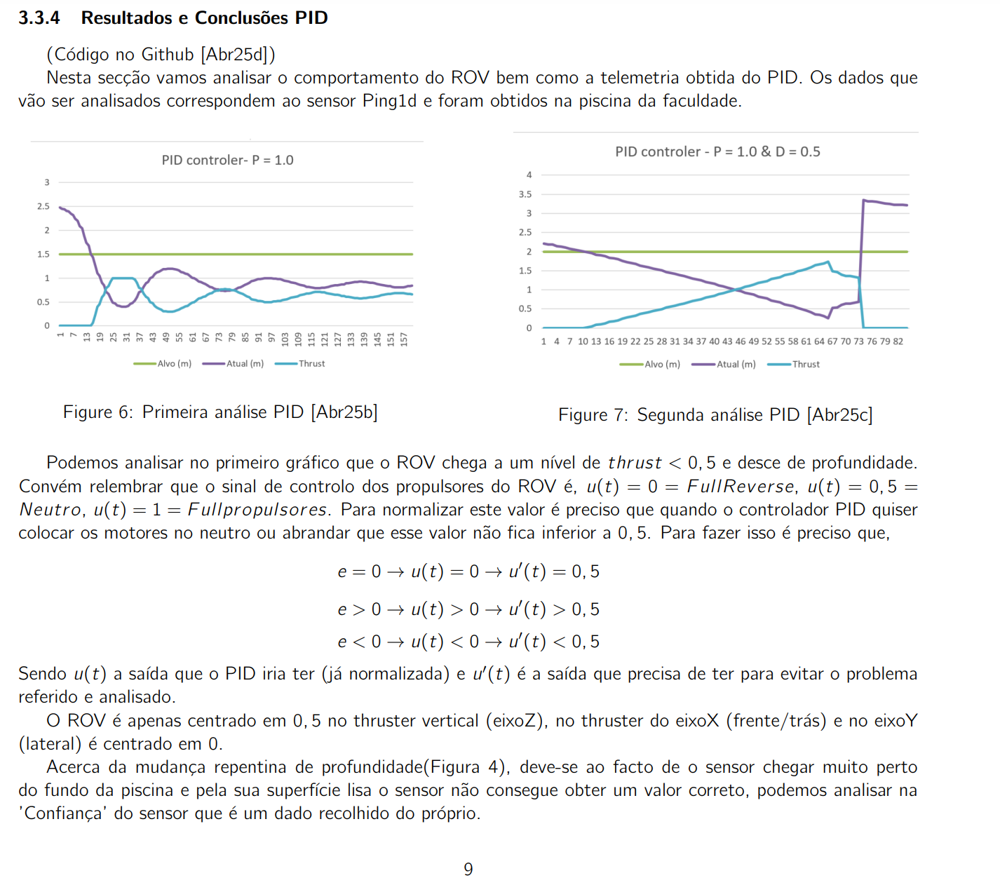
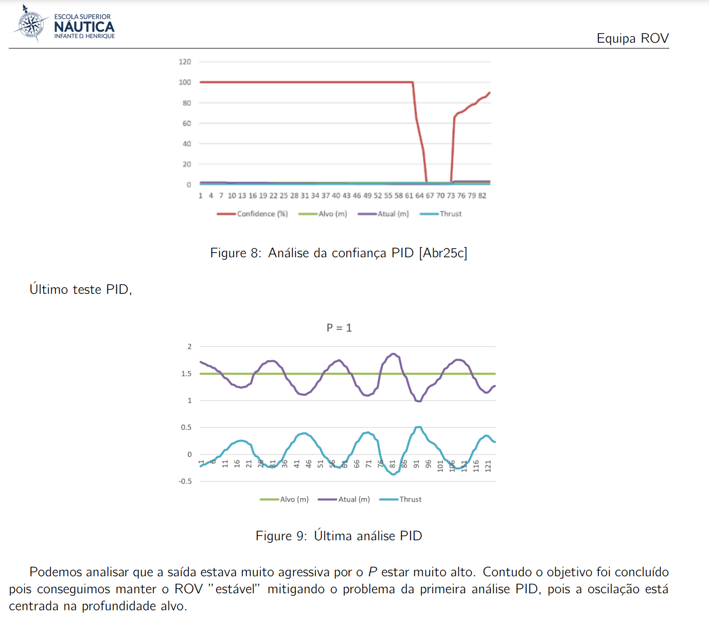
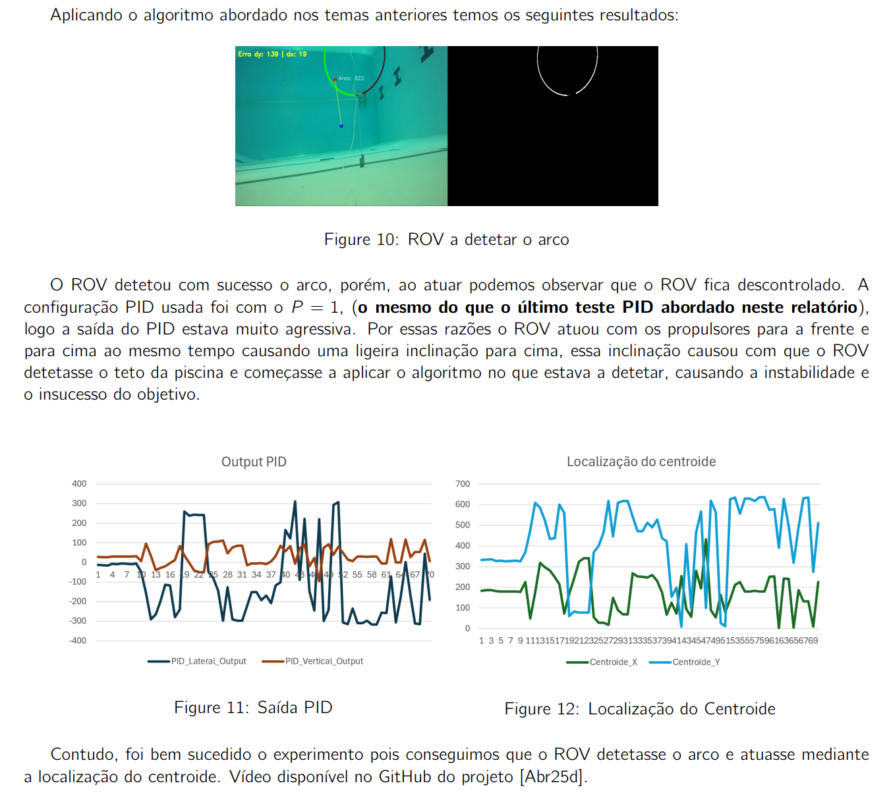

# BlueRovProject

--------------------------------------------------------------------------------

Done when studing in Escola Náutica Infante Dom Henrique.

 

Project Role: Project Manager overseeing 6 teams comprising 12 members in total.

📦 my-project/
├── 📁 codigo/                      # Código-fonte do projeto
│ ├── 📁 codigoFinal/               # Código usado no último teste real
│ │ ├── analisaCSVFINAL.py          # Analisa o CSV derivado do testeTrackFunc.py
│ │ ├── pidController.py            # Classe do controlador PID
│ │ ├── redTrackCentroide.py        # Classe responsável pela visão computacional
│ │ ├── ROVlateralvertical.py       # Interface com os sistemas do ROV (sensores e atuadores)
│ │ ├── manterProfundidade.py       # Teste de manutenção de profundidade com PID
│ │ ├── testeTrackFunc.py           # Teste de rastreamento visual com o ROV
│ │ └── testeROV.py                 # Teste de ligação e propulsores do ROV
│ ├── 📁 dataProcessing/            # Scripts de pré-processamento de dados
│ │ └── processarDados.py           # Processa o output gerado pelo manterProfundidade.py
│ └── 📁 notUsed/                   # Código descartado ou versões antigas
├── 📁 mydocs/                      # Documentação e relatórios
│ ├── rCritica_ROVarticleOcean.pdf # Recensão crítica a um artigo científico
│ ├── REPORTprojetoBlueROV2.pdf     # Relatório final do projeto BlueROV2
│ └── 📁 telemetria/                # Dados e observações de testes reais
├── 📁 models/                      # Modelos salvos (ex: redes neurais ou PID tunados)
├── 📁 tests/                       # Testes unitários e de integração
├── LICENSE                         # Licença de uso
├── README.md                       
├── pyvenv.cfg                      # Configuração do ambiente virtual Python
├── requirements.txt                # Lista de dependências Python
├── .gitattributes                  # Configurações de Git para arquivos de texto
└── .gitignore                      # Arquivos ignorados pelo Git

# Results:
## PID

## Vision

